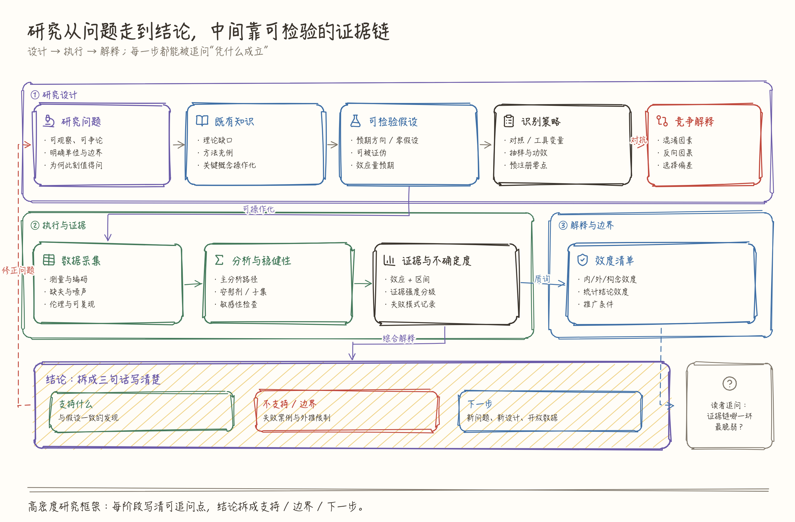
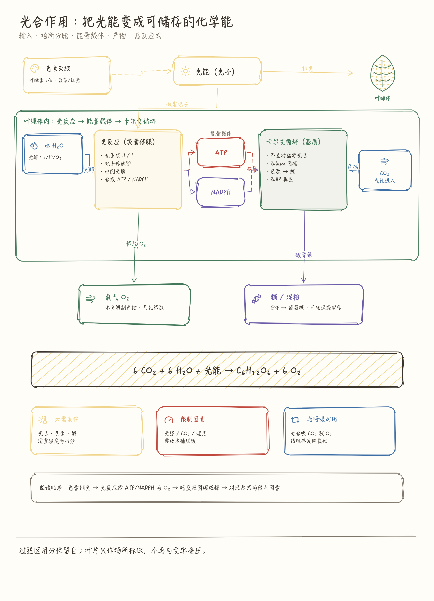
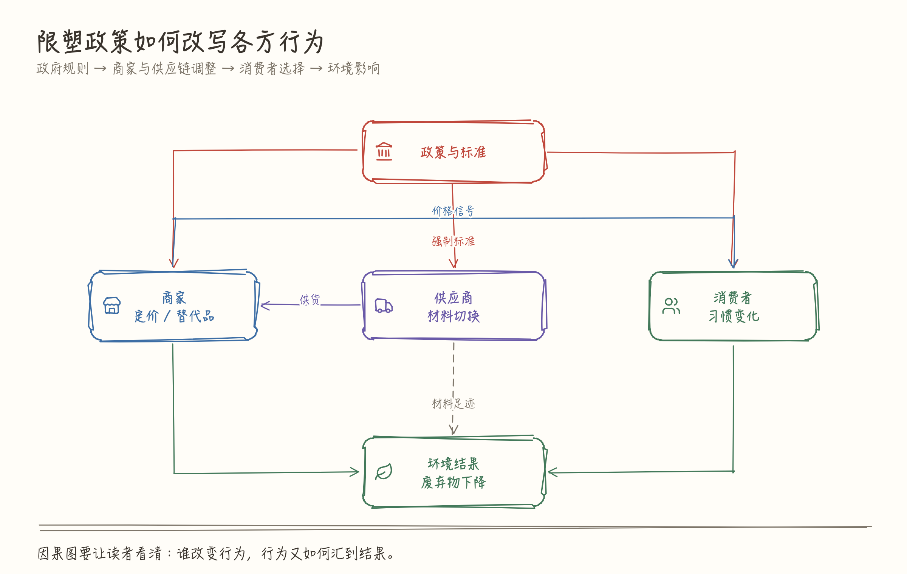
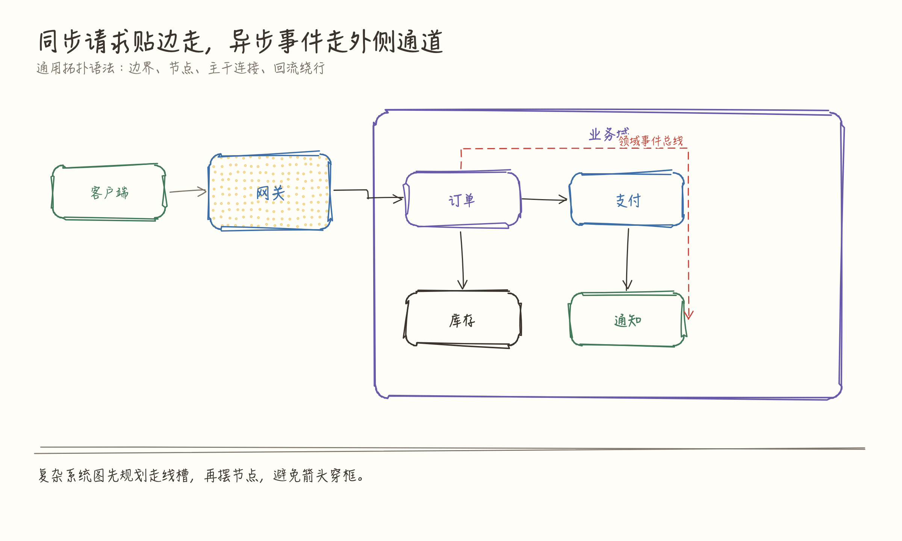
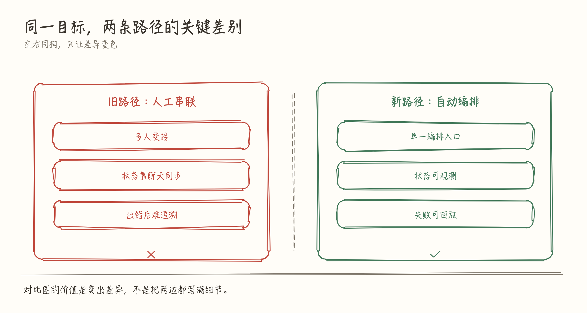
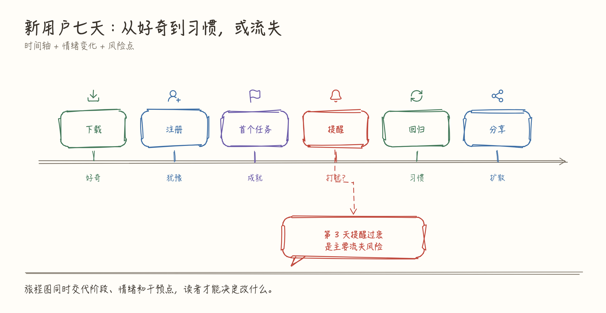
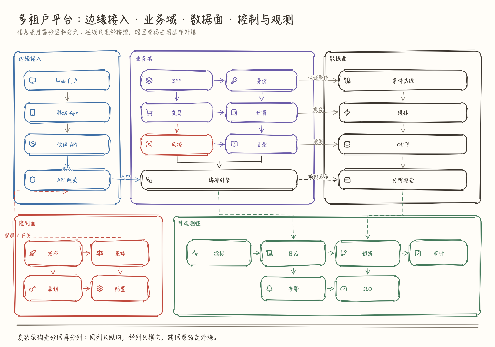
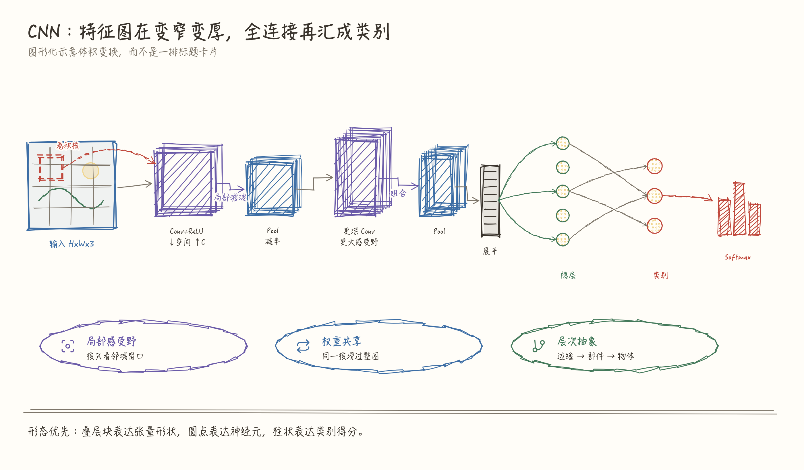

# sketch-infographic

面向所有用户和领域的开源 Agent Skill：把结构、流程、关系、比较、层级、时间和概念
转成白板手绘风格信息图。既支持拓扑方框图，也支持用圆、叠层块、`path` 等表达形态与变换
的图形化示意。可用于研究、教学、技术架构、业务分析、产品方案和内容创作；
输出 SVG，也可导出 PNG，不局限于内置模板和当前案例。

图是代码生成的，能进 Git、能改、能重渲；改图走本地渲染，不用反复调图像模型，**省 Token！**。

## 跨领域案例

<table>
  <tr>
    <td width="50%" valign="top">
      <p><b>研究框架</b><br/>
      <sub>设计 / 执行 / 解释三层：每阶段可追问点 + 结论拆分</sub></p>
      <a href="examples/images/01-research-framework.png"></a>
    </td>
    <td width="50%" valign="top">
      <p><b>光合作用教学图</b><br/>
      <sub>光/暗反应分舱 · ATP/NADPH · 总式与限制因素</sub></p>
      <a href="examples/images/02-photosynthesis.png"></a>
    </td>
  </tr>
  <tr>
    <td width="50%" valign="top">
      <p><b>政策影响路径</b><br/>
      <sub>政府、商家、供应链、消费者与环境（卡片内图标 + parent）</sub></p>
      <a href="examples/images/03-policy-path.png"></a>
    </td>
    <td width="50%" valign="top">
      <p><b>服务拓扑</b><br/>
      <sub>同步贴边连接，异步外侧绕行</sub></p>
      <a href="examples/images/04-service-topology.png"></a>
    </td>
  </tr>
  <tr>
    <td width="50%" valign="top">
      <p><b>路径对比</b><br/>
      <sub>左右同构，只让差异变色</sub></p>
      <a href="examples/images/05-approach-compare.png"></a>
    </td>
    <td width="50%" valign="top">
      <p><b>新用户旅程</b><br/>
      <sub>时间轴、情绪变化与流失风险</sub></p>
      <a href="examples/images/06-onboarding-journey.png"></a>
    </td>
  </tr>
  <tr>
    <td width="50%" valign="top">
      <p><b>多租户平台架构</b><br/>
      <sub>边缘 / 业务域 / 数据面 / 控制面 / 可观测性：分列邻接连线</sub></p>
      <a href="examples/images/07-platform-architecture.png"></a>
    </td>
    <td width="50%" valign="top">
      <p><b>CNN 结构（形态示意）</b><br/>
      <sub>特征图叠层变窄变厚 · 神经元圆点 · Softmax 柱，而不是方框标题墙</sub></p>
      <a href="examples/images/08-cnn-structure.png"></a>
    </td>
  </tr>
</table>


## 怎么用

### 1. 安装

```bash
npx skills add morvanzhou/sketch-infographic
```

### 2. 让 Agent 画

装好后直接说你要什么图，例如：

- 「画一张 Transformer 架构图」
- 「用特征图叠层画一张 CNN 结构示意，不要方框流水线」
- 「把这篇论文的方法、实验和结论画成研究框架图」
- 「给学生画一张光合作用的概念关系图」
- 「把这份政策方案画成利益相关方与影响路径图」
- 「画一下推荐系统的召回-排序链路」
- 「画一张同步/异步分开的微服务拓扑」

Agent 会选图式（拓扑或形态）、写图、渲染，并打开结果核对。

### 3.（可选）把图留在项目里

需要长期维护时，让 Agent 把脚本落到项目目录，之后随时改坐标重渲：

```bash
node $SKILL/scripts/init.mjs <项目里的图形目录> --name figures
cd <项目里的图形目录>
node render.mjs figures.mjs --lint-strict
node render.mjs figures.mjs --png
```

## 不适合什么

- 大规模数据探索、统计推断或需要交互筛选的专业图表（简单数据图仍可作为信息图的一部分）
- 照片级插画或封面（白板级图形化示意可以，写实插画请用别的工具）
- 只要一个极简流程图、团队已统一用 Mermaid

## License

[MIT](LICENSE)。Lucide 图标数据遵循 ISC，版本与声明见
`skills/sketch-infographic/scripts/lucide-icons.mjs` 文件头。
