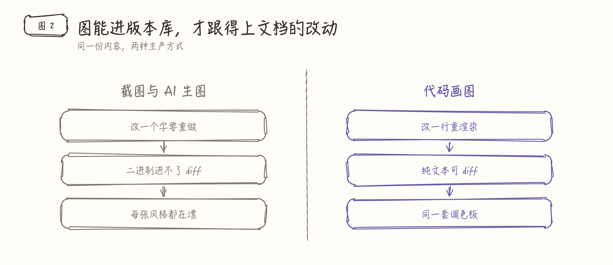
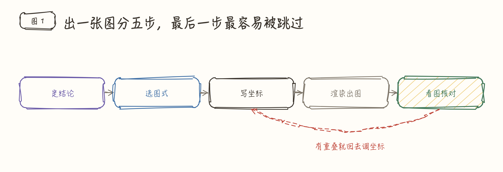
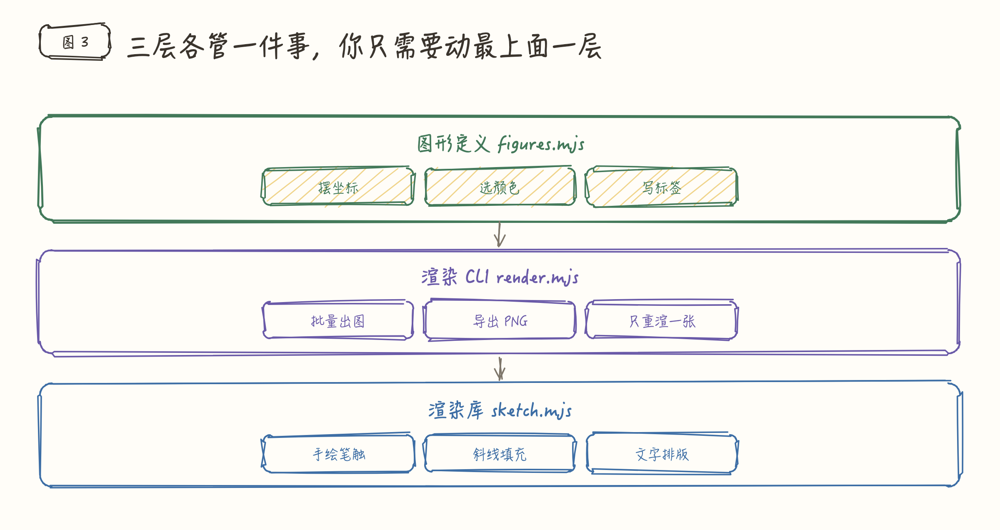
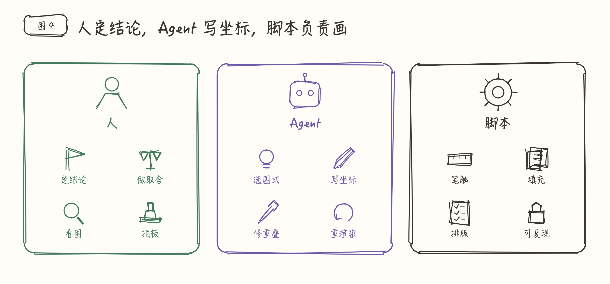
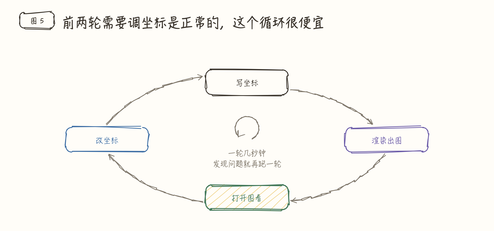
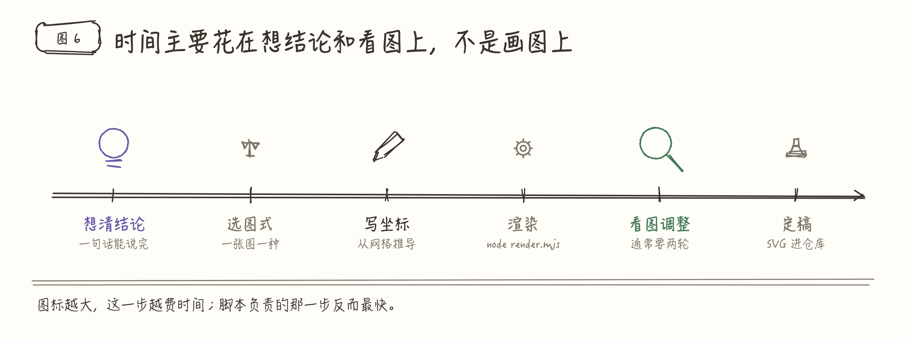

# sketch-infographic

用零依赖的 Node 脚本画手绘风格信息图：架构图、流程图、对比图、分层图、闭环图、分工图、时间线。输出 SVG，可选导出 PNG。

图定义是纯文本，能进 Git、能继续改、能一键重渲染；同样的输入每次得到完全相同的输出。不需要 `rough.js`、Playwright、Puppeteer、canvas 或任何 npm 包，有 Node（≥ 18）就能跑。

适合给文章、README、周报、方案、复盘、培训材料、公众号推文、PPT 配结构示意图。

## 它解决什么问题

常见配图方式各有硬伤：

- **Mermaid**：布局不可控、样式单调
- **AI 生图**：文字容易出错，改一个字要重抽
- **Figma / 截图**：进不了版本库，没法 diff

这套方案用代码描述图：按坐标摆放卡片、箭头、图标和文字，库内部把每条线重绘两遍并加上固定随机抖动，得到白板手绘质感。



## 效果预览

下面六张图覆盖六种常用图式，全部由 [`examples/figures.mjs`](examples/figures.mjs) 生成，讲的就是这个 skill 自己。想改就改坐标重渲染：

```bash
cd examples && node render.mjs figures.mjs --png
```

**横向流程** —— 步骤、链路、生命周期



**纵向分层** —— 系统架构、职责分层



**并列分工** —— 角色职责划分



**闭环** —— 反馈、迭代、修复回路



**时间线** —— 阶段演进、里程碑



左右对比的例子就是本文开头那张图。

## 安装

```bash
npx skills add morvanzhou/sketch-infographic
```

下文把安装后的 skill 目录记作 `$SKILL`。

## 快速开始

### 方式 A：落地到目标项目（推荐）

适合图要长期维护、跟着项目走、别人 clone 下来也能重渲染：

```bash
node $SKILL/scripts/init.mjs <项目里的图形目录> --name figures
```

会把 `sketch.mjs`、`render.mjs` 和一个含四种常用图式的 `figures.mjs` 模板复制过去。复制之后那个目录完全自包含，不再依赖 skill 路径：

```bash
cd <项目里的图形目录>
node render.mjs figures.mjs --png
```

### 方式 B：直接引用 skill 里的库

适合一次性出图、不打算把脚本留在项目里：

```js
import { createSketch, INK, GREEN, VIOLET } from '$SKILL/scripts/sketch.mjs';
```

然后：

```bash
node $SKILL/scripts/render.mjs figures.mjs --out ./images --png
```

落地到项目时优先选方式 A。方式 B 的绝对路径换台机器就失效。

## 渲染

```bash
node render.mjs figures.mjs                      # 只出 SVG，零依赖最快
node render.mjs figures.mjs --png                # 同时出 PNG
node render.mjs figures.mjs --png --only 01-flow # 只重渲染一张
node render.mjs figures.mjs --list               # 列出有哪些图
```

| 参数 | 说明 |
|------|------|
| `--out` | 输出目录，默认图形文件同级的 `images/` |
| `--png` | 附带 PNG（调用本机已装的 Chrome / Chromium / Edge / Brave） |
| `--scale` | PNG 像素倍率，默认 2 |
| `--only` | 逗号分隔的图 id |
| `--chrome` | 手动指定浏览器路径，也可用环境变量 `CHROME_PATH` |

SVG 渲染全程只用 Node 标准库。只有需要 PNG 时才走本机浏览器命令行截图，不安装任何 npm 包。

## 写一张图

一张图 = 一个函数，最后导出 `FIGURES`：

```js
import { createSketch, INK, GREEN, VIOLET, YELLOW, GRAY } from './sketch.mjs';

function myFigure() {
  const s = createSketch(1200, 500);
  s.header({ label: '图 1', title: '标题就是这张图的结论', sub: '可选副标题' });

  s.card(80, 180, 220, 60, '输入', { stroke: GREEN });
  s.arrow(304, 210, 372, 210, { stroke: GRAY });
  s.box(380, 150, 420, 200, { stroke: VIOLET, fill: YELLOW, hachureGap: 18 });
  s.text(400, 170, 380, '处理层', { size: 22, weight: 700, align: 'center', color: VIOLET });

  return s;
}

export const FIGURES = [['01-my-figure', myFigure]];
```

动手写坐标前先定三件事：

1. 这张图的唯一结论是什么（它就是标题）
2. 用哪种结构承载（一张图只用一种主结构）
3. 画面上留多少元素（顶层块 3～7 个，超过就拆图）

图上文字只放 2～6 字标签，论述留给正文。

### 图式

| 图式 | 适合表达 |
|------|---------|
| 横向流程 | 步骤、链路、生命周期 |
| 左右对比 | 新旧方案、有无某能力 |
| 纵向分层 | 系统架构、职责分层 |
| 并列分工 | 角色职责划分 |
| 闭环 | 反馈、迭代、修复回路 |
| 中心辐射 | 上下文、依赖来源 |
| 时间线 | 阶段演进、里程碑 |

除中心辐射外，其余六种都能在[效果预览](#效果预览)里看到成图，对应代码在 [`examples/figures.mjs`](examples/figures.mjs)。skill 自带的 `assets/template-figures.mjs` 也实现了其中四种，照抄改比从空文件写快。

完整 API 见 [`skills/sketch-infographic/references/api.md`](skills/sketch-infographic/references/api.md)，排版与避坑见 [`skills/sketch-infographic/references/layout.md`](skills/sketch-infographic/references/layout.md)。Agent 工作流程见 [`skills/sketch-infographic/SKILL.md`](skills/sketch-infographic/SKILL.md)。

## 设计约定

- 一张图一个结论，标题直接写结论，不写「XX 示意图」
- 颜色表达语义而非装饰：`INK` 中性、`GREEN` 人与正向结果、`VIOLET` 核心处理、`BLUE` 数据与规范、`RED` 风险与边界、`GRAY` 次要信息
- 强调靠填充和线宽：主块用 `fill: YELLOW` 或 `sw: 2.2`
- 虚线专表示非主干：反馈、回流、可选路径用 `dash: true`
- 标签短，超过 8 个字就换个说法
- 画布宽度建议统一 1200，高度按内容定

## 什么时候不要用

- 精确数值的统计图表（柱状、折线、饼图）：用手绘风不适合承载数据
- 照片级插画或封面：那是 AI 生图的活
- 团队已统一用 Mermaid 且只要一个极简流程图：沿用 Mermaid 更省事

## 目录结构

```
sketch-infographic/
├── README.md
├── examples/                         README 里那六张图的完整工程
│   ├── figures.mjs                   六种图式的图形定义
│   ├── sketch.mjs                    由 init.mjs 复制而来
│   ├── render.mjs                    由 init.mjs 复制而来
│   └── images/                       渲染产物（SVG + PNG）
└── skills/sketch-infographic/
    ├── SKILL.md                      Agent 入口与工作流程
    ├── scripts/
    │   ├── sketch.mjs                零依赖渲染库
    │   ├── render.mjs                渲染 CLI
    │   └── init.mjs                  把脚本 + 模板落地到目标项目
    ├── assets/
    │   └── template-figures.mjs      四种常用图式模板
    └── references/
        ├── api.md                    API、参数、图标清单
        └── layout.md                 坐标排版与重叠避坑
```

`examples/` 就是「方式 A」跑出来的结果：`init.mjs` 复制脚本，自己写 `figures.mjs`，再 `node render.mjs figures.mjs --png`。

## License

MIT
